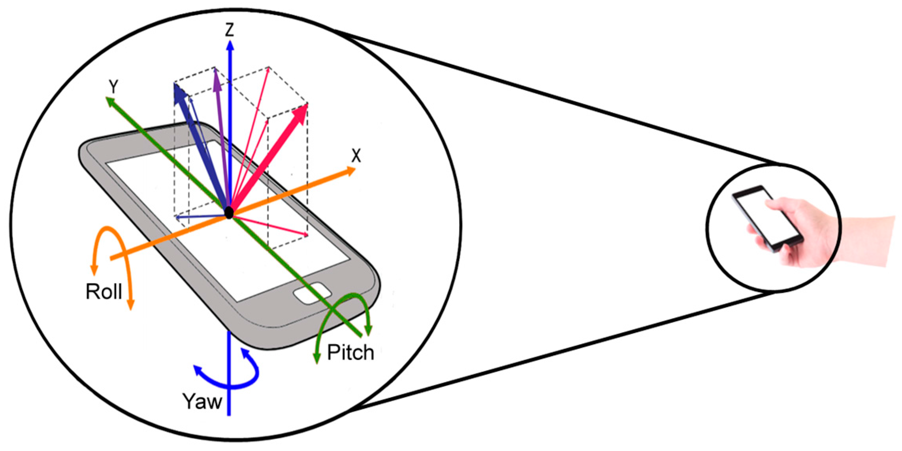

# Spirit level app (Libela app)

Zadatak ovog seminarskog rada i projekta bio je razviti mobilnu aplikaciju koja koristi senzore mobilnog uređaja. Prilikom razvoja koristio sam razvojni okvir **NativeScript** s JavaScript programskim jezikom. 

Aplikacija koju sam razvio koristi akcelerometar senzor na uređaju u svrhu prikaza položaja uređaja u prostoru, odnosno koristi će se kao mjerni istrument Libela.

Libela je mjerni instrument koji služi za postavljanje osi u vertikalni ili horizontalni položaj. 


---

## Nativescript

**Nativescript** je razvojni okvir otvorenog koda za razvoj mobilnih aplikacija za više platformi. Pomoću njega moguće je stvoriti aplikacije za iOS i Android operacijske sustave iz jedne baze koda. Zajedno s NativeScriptom moguće je koristiti popularne web razvojne jezike i okvire kao što su JavaScript, Angular i Vue.js. U ovom slučaju korišten je **JavaScript**. 

NativeScript je također odabran zbog jednostavnog pristupa API nativne platforme, kao što su kamera ili u našem slučaju senzori. 

Početne datoteke aplikacije možemo stvoriti pomoću sljedeće naredbe:

```
$ ns create SpiritLevelApp --template @nativescript/template-blank
```

SpiritLevelApp je naziv aplikacije, a nakon --tamplate argumenta naveden je početni predložak, u ovom slučaju to je prazni predložak.


Zatim je potrebno dodati platformu za koju razvijamo, u ovom slučaju to će biti samo Android platforma:
```
$ ns platform add android
```

---

## Akcelerometar

Za ovu aplikaciju potrebni dobiti očitanja akcelometra na uređaju. Kako bi mogli na jednostavan način pristupiti tim podatcima dodajemo plugin *nativescript-accelerometer* pomoću sljedeće naredbe:

```
$ tns plugin add nativescript-accelerometer
```
 
 No pošto je ovaj plugin namjenjen za verziju 3.x NativeScripta, a u ovom projektu je korištena verzija 8.x, bilo je potrebno napraviti par izmjena u datoteci plugin-a. 

 Datoteke plugin-a mogu se pronaći u node_modules direktoriju. U ovom direktoriju u repozitoriju se nalazi samo ovaj plugin, no prilikom kloniranja repozitorija i pokretanja aplikacije dodati će se i ostali potrebni moduli.

./node_modules/nativescript-accelerometer/index.android.js:

```js
Object.defineProperty(exports, "__esModule", { value: true });
var utils_1 = require("@nativescript/core"); // updated
var messages_1 = require("./messages");
var baseAcceleration = -9.81;
var sensorListener;
var sensorManager;
var accelerometerSensor;
function getNativeDelay(options) {
    if (!options || !options.sensorDelay) {
        return android.hardware.SensorManager.SENSOR_DELAY_NORMAL;
    }
    switch (options.sensorDelay) {
        case "normal":
            return android.hardware.SensorManager.SENSOR_DELAY_NORMAL;
        case "game":
            return android.hardware.SensorManager.SENSOR_DELAY_GAME;
        case "ui":
            return android.hardware.SensorManager.SENSOR_DELAY_UI;
        case "fastest":
            return android.hardware.SensorManager.SENSOR_DELAY_FASTEST;
    }
}
function startAccelerometerUpdates(callback, options) {
    if (isListening()) {
        console.log(messages_1.startButNotStopped);
        stopAccelerometerUpdates();
    }
    var wrappedCallback = zonedCallback(callback);
    // updated
    var context = utils_1.Utils.ad.getApplicationContext();
    if (!context) {
        throw Error("Could not get Android application context.");
    }

...
```

Ažurirane u dvije linije koda kod kojih piše "updated" komentar. U prvoj je zamijenjen modul s *tns-core-modules/utils/utils* na *@nativescript/core*, dok je u drugoj dodan *.Utils.ad* kako bi funkcija getApplicationContext() ispravno funkcionirala.

---

## Aplikacija

Sve dodateke bitne za funkcionalnost aplikacije nalaze se u direktoriju ./app, a u njemu možemo naći sljedeću strukturu:
```
$ tree ./app
./app
├── app.css
├── app.js
├── app-root.xml
└── home
    ├── home-page.js
    ├── home-page.xml
    └── home-view-model.js

1 directory, 6 files
```

Datoteka app.js predstavlja ulaznu točku aplikacije, u njoj specificiramo početnu točku pomoću funkcije **Application.run()**. Ova funkcija se pokreće pri pokretanju aplikacije i vodi nas na sljedeću datoteku "app-root.xml".

```js
import { Application } from '@nativescript/core'

Application.run({ moduleName: 'app-root' })
```

---

U app-root navedena je početna stranica aplikacije, odnosno home/home-page:

```js
<Frame defaultPage="home/home-page" />
```
Pomoću ove linije koda prikazuje nam se početna stranica aplikacije koja je pohranjena u home/home-page.xml.

---

Kod u datoteci home/home-page.xml definira izgled stranice.
```xml
    <GridLayout rows="auto auto auto auto auto auto auto auto *" columns="auto * auto">
        <Label colSpan="3" row="1" opacity="0" id="shake-view" text="Umirite se!" class="h2" verticalAlignment="top" horizontalAlignment="center" />
        
        <GridLayout row="2" colSpan="3" columns="{{ y }}" class="progressbar-vertical">
            <StackLayout col="0" class="progressbar-value"></StackLayout>
        </GridLayout>

        <GridLayout row="2" colSpan="3" columns="{{ x }}" class="progressbar-horizontal">
            <StackLayout col="0" class="progressbar-value"></StackLayout>
            
        </GridLayout>

        <StackLayout row="2" colSpan="3" class="middle-marker-horizontal"></StackLayout>
        <StackLayout row="2" colSpan="3" class="middle-marker-vertical"></StackLayout>

        <TextField row="3" colSpan="3" style="margin-top: 22%" verticalAlignment="top"/>

        <TextField row="4" colSpan="1" text= "Roll angle:" horizontalAlignment="left"/>
        <TextField row="4" colSpan="2" text= "{{ roll }}" horizontalAlignment="center"/>

        <TextField row="5" colSpan="3" text= "Pitch angle:" horizontalAlignment="left"/>
        <TextField row="5" colSpan="3" text= "{{ pitch }}" horizontalAlignment="center"/>

        <Button colSpan="3" row="6" class="{{ button }}" text="{{ isListening ? 'Zaustavi mjerenje' : 'Nastavi mjerenje'}}" tap="toggleUpdates" />
    </GridLayout>
```

Podijelili smo prikaz na više redova (row) i stupaca (col). Na vrhu stranice prikazuje se text "Umirite se!" ukoliko je detektiran veliki porast u drhtanju mobilnog uređaja.


Zatim slijedi prikaze libela, odnosno horizontalna i vertikalna traka napredka. Njihove vrijednosti se ispunjavaju ovisno o položaju mobilnog uređaja (funkcionalnost je definirana u home/home-page.js, o sadržaju te datoteke nešto više kasnije). Također postavljamo nišan u sredinu kako bi korisnik aplikacije mogao intuitivnije koristiti aplikaciju. Ispod libela nalazi se prikaz kuta rotacije za roll i pitch, te na kraju se nalazi gumb koji zaustavlja mjerenje te mjenja boju ovisno o zaustavljenom/pokrenutom mjerenju. 


---

Kako bi sučelje, odnosno elementi u home-page.xml, postali dinamički potrebno je definirati njihovu logiku i funkcionalnost. To radimo u home/home-page.js. Određujemo reakciju na evente kao što je pritisak na gumb ili promjenu vrijednosti akcelerometra. U nastavku su objašnjeni dijelovi koda.

```js
const shakeDetector = new Shake(() => {
    // ovo ce se izvrsiti pri pozivu onSensorData() funkcije (ako su zadovoljeni uvjeti)
    shakeView.opacity = 1;
    shakeView.scaleX = 2;
    shakeView.scaleY = 2;
    shakeView.animate({
        duration: 1000,
        opacity: 0,
        curve: "easeOut"
    });
});
```
Ovim dijelom koda stvaramo novu instancu klase Shake (pohranjenu u **shakeDetector**) i definiramo funkciju koja će se izvoditi prilikom detektiranja drhtanja mobilnog uređaja (klasa Shake je definirana u home-view-model.js, dotaknuti ćemo se njenog sadržaja nešto kasnije). Animirati će se tekst koji će biti idetificiran pod **shakeView**.Animirani tekst će se povećati za dva puta te će postati ne proziran, prikazivati će se jednu sekundi prije nego što ponovno nestane. 

```js
function CalculateInclanation(data) {
    function deg(inc){
        if(inc < 0){
            inc = 360+inc;
        }
        return inc
    }
    let inclanation = {
        roll: Math.abs(Math.atan2(data.y, data.z) * (180/Math.PI) - 180),
        pitch: deg(Math.atan2(-data.x, Math.sqrt(Math.pow(data.y, 2) + Math.pow(data.z, 2))) * (180/Math.PI))
    }
    return inclanation
}

// funkcija koja azurira vrijednosti x, y i prikazujemo da je detektiran shake
function update(data) {
    let ykoordinata = (data.y.toFixed(2) * 50 + 50) + "*," + (100 - (data.y.toFixed(2) * 50 + 50)) + "*";
    let xkoordinata = (data.x.toFixed(2) * 50 + 50) + "*," + (100 - (data.x.toFixed(2) * 50 + 50)) + "*";

    context.set("x", xkoordinata);
    context.set("y", ykoordinata);
    context.set("roll", CalculateInclanation(data).roll.toFixed(2));
    context.set("pitch", CalculateInclanation(data).pitch.toFixed(2));

    shakeDetector.onSensorData(data);
}
```

U funkciji **update()** povezujemo vrijednosti iz .xml datoteke (x, y, roll i pitch) s vrijednostima dobivenim iz akcelerometra. Pošto se x i y vrijednosti pokazuju kao vrijednosti libela potrebno ih je pretvoriti u postotak, a vrijednosti kuta roll i pitch izračunavamo u funkciji **CalculateInclanation()**. Na slici u nastavku je vidiljo što zapravo roll i pitch predstavljaju.



```js
// Event handler za "navigatingTo" event u home-page.xml
export function navigatingTo(args) {
    let page = args.object;
    page.bindingContext = context;
    shakeView = page.getViewById("shake-view");
    context.set("button", "button-zaustavi");
    try {
        startAccelerometerUpdates(update, { sensorDelay: "ui" });
    } catch (e) {
        alert("Error: " + e.message);
    }

    context.set("isListening", isListening());
}
```

Funkcija **navigateTo()** služi kao upravljač eventima u home-page.xml datoteci. Povezujemo element s identifikatorom "shake-view". U njemu će se prikazivati animacija definirana ranije, odnosno to će biti animacija za drhtanje i poruku "Umirite se!". Zatim pokrećemo mjerenje akcelerometrom pomoću funkcije **startAccelerometerUpdates()** kojoj prosljeđujemo funkciju **update()** kako bi se vrijednosti mogle ažurirati u prikazu. Također, postavljamo **klasu gumba** i vrijednost **isListening** kako bi se pokazivao gumb za zaustavljanje mjerenja. 

```js
// funkcija za gumb
export function toggleUpdates() {
    if (isListening()) {
        stopAccelerometerUpdates();
        context.set("button", "button-pokreni");
    } else {
        try {
            startAccelerometerUpdates(update, { sensorDelay: "ui" });
            context.set("button", "button-zaustavi");
        } catch (e) {
            alert("Error: " + e.message);
        }
    }

    context.set("isListening", isListening());
}
```

Zadnja funkcija u home-page.js je **toggleUpdates()** funkcija koja se izvodi prilikom pritiska na gumb za zaustavljanje/pokretanje mjerenja. Pomoću ove funkcije se pokreće ili zaustavlja mjerenje accelerometrom te se mjenja izgled gumba ovisno o trenutnom stanju.

---

U datoteci home/home-view-model.js je definirana klasa Shake s funkcionalnosti detektiranja drhtanja mobilnog uređaja. Instanca klase Shake se stvara u datoteci home-page.js.

```js
const Parameters = {
    // nakon ovoliko shake-a ce se izvrsiti funkcija cb
    shakeCount: 2,

    // timeout izmedju dvije provjere shake-a u ms
    checkTimeout: 100,

    // razmak izmedju dva shakea u ms
    shakeTimeout: 1000,

    // timeout izmedju izvrsavanja cb funkcije u ms
    cbTimeout: 800,

    // koliki mora biti vektor sile da se smatra da je shake
    forceThreshold: 0.2
}
```

Na početku su definirani konstantni parametri koji se koriste kako bi se detektiralo drhtanje te kako bi se izvela određena radnja. U komentarima možemo vidijeti koja je svrha svakog. 

```js
export class Shake {
    #shakeCount = 0;
    #lastShake = 0;
    #lastForce = 0;
    #lastTime = 0;
    #callbackFunction;

    constructor(callback) {
      // prosljedjenu funkciju spremamo u cb
      this.#callbackFunction = zonedCallback(callback);
    }


    onSensorData(data) {
      const now = time();
      if ((now - this.#lastForce) > Parameters.cbTimeout) {
          this.#shakeCount = 0;
      }

      const timeDelta = now - this.#lastTime;
      if (timeDelta > Parameters.checkTimeout) {
          // izracun za vektor sile
          const forceVector = Math.abs(Math.sqrt(Math.pow(data.x, 2) + Math.pow(data.y, 2) + Math.pow(data.z, 2)) - 1);
          // ako je vektor dovoljno "velik" onda se smatra ko shake
          if (forceVector > Parameters.forceThreshold) {
              this.#shakeCount++;
              // ako su detektirana 2 (Parameters.shakeCount) shaka i ako je proslo 1000 ms od proslog onda izvrsavamo cb
              if ((this.#shakeCount >= Parameters.shakeCount) && (now - this.#lastShake > Parameters.shakeTimeout)) {
                  this.#lastShake = now;
                  this.#shakeCount = 0;
                  
                  // izvrsavamo cb, to ce biti animacija teksta "Umirite se!"
                  this.#callbackFunction();
              }
              this.#lastForce = now;
          }

          this.#lastTime = now;
      }
  }
}
```

U konstruktor klase Shake šaljemo funkciju koja će se izvoditi prilikom detekcije drhtanja, ta funkcije se pohranjuje u **callbackFunction**. U home-page.js prosljeđena je animacija teksta "Umirite se!". 

Klasa ima funkciju **onSensorData()** u kojoj se vrši detekcija drhtanja. Izračunavamo vektor sile pomoću podataka iz akcelerometra (oni se prosljeđuju kao argument funkcije). Ukoliko vektor sile prelazi jačinu definiranu u parametrima na početku to se smatra drhtanjem te se pomoću ostalih parametra određuje ako se izvodi funcija koja je prosljeđena u konstruktoru. Ovaj dio koda je izveden na ovaj način pošto bi se u protivnom funkcija **callbackFunction()** izvodila prilikom svake detekcije te bi se tekst "Umirite se!" prikazivao preko prijašnjeg teksta. 

---

Zadnja uređena datoteka je app.css u kojoj se nalaze css stilovi kako bi poboljšali izgled korisničkog sučelja. To su stilovi za traku napretka (libel) i gumbe.

---

## PROFILIRANJE APLIKACIJE

Kako bi aplikaciju mogli profilirati unutar Android studia potrebno ju je prvo izgraditi. To činimo naredbom u nastavku.

```
$ tns build android --copy-to <putanja mjesta spremanja>
```

Nakon što je aplikacija izgrađena možemo ju otvoriti u Android studiju (File -> Profile or Debug APK, zatim odaberemo .apk datoteku stvorenu izgradnjom).

Priključimo mobilni uređaj, pokrenemo aplikaciju i pogledamo u karticu Profilera. Vidimo da se izvršava mjerenje (.trace datoteke se mogu naći u korijenu repozitorija). 

---


Vidimo da pri pokretanju aplikacije iskorištenost CPU-a, memorije i energije poraste, no ubrzo se stabilizira. 

---


Aplikacija u mirovanju torški gotovo konstantu vrijednost memorije (140 MB). Isto se dešava i s iskorištenosti CPU-a (5%). Također, aplikacija troši iznimno malo energije. 

---


Prilikom drhtanja mobitela vidimo porast u iskorištenosti memorije (165 MB) te također porast u iskorištenosti CPU-a (10%). Potrošnja energije ostaje na istoj razini. 

---


Pogledom na procese i Flame Chart vidimo da niti jedan proces ne stvara probleme, odnosno ne odskače od ostalih. 

---

## Literatura

https://hackmd.io/@mateaturalija/r1_zhHh_o

https://v7.docs.nativescript.org/angular/tooling/android-virtual-devices

https://v7.docs.nativescript.org/angular/start/ns-setup-linux

https://docs.nativescript.org/environment-setup.html#linux-android

https://developer.android.com/studio/install#linux

https://blog.nativescript.org/nativescript-7-for-plugin-authors/

https://github.com/triniwiz/native-script-accelerometer

https://blog.nativescript.org/building-a-simple-progressbar-for-your-nativescript-app/

https://hackmd.io/@mateaturalija/ByKLNv49o

Slika 5: https://www.mdpi.com/1424-8220/17/9/2043